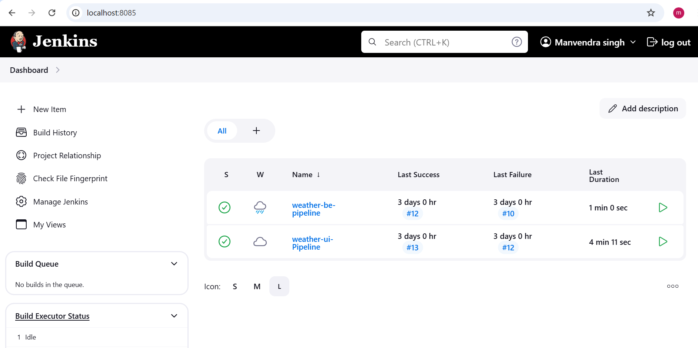
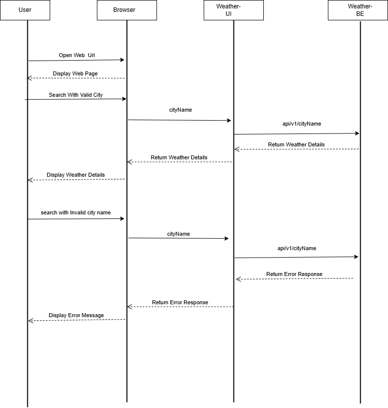
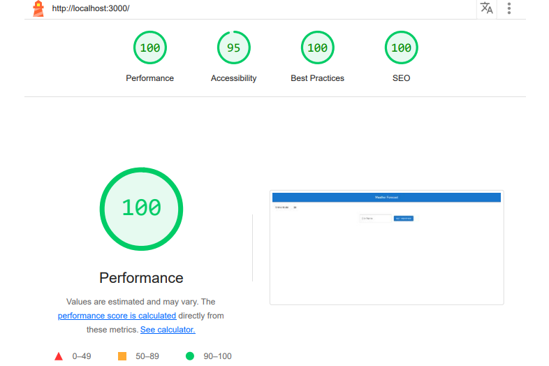

# manvendra-carft-review-case-study


## Getting started

To make it easy for you to get started with GitLab, here's a list of recommended next steps.

Already a pro? Just edit this README.md and make it your own. Want to make it easy? [Use the template at the bottom](#editing-this-readme)!

## Add your files

- [ ] [Create](https://docs.gitlab.com/ee/user/project/repository/web_editor.html#create-a-file) or [upload](https://docs.gitlab.com/ee/user/project/repository/web_editor.html#upload-a-file) files
- [ ] [Add files using the command line](https://docs.gitlab.com/ee/gitlab-basics/add-file.html#add-a-file-using-the-command-line) or push an existing Git repository with the following command:

```
cd existing_repo
git remote add origin https://pscode.lioncloud.net/rohdubey2/manvendra-carft-review-case-study.git
git branch -M main
git push -uf origin main
```

***

# Weather Application

A comprehensive Weather Application built with Spring Boot and React that fetches real-time weather data, processes conditions like high winds and thunderstorms, and presents users with a responsive interface. This application utilizes AWS services for file storage and Kubernetes for deployment orchestration, ensuring a scalable and reliable production environment.

## Table of Contents
- [Overview](#overview)
- [Architecture](#architecture)
- [Pipeline](#pipeline)
- [Output](#output)

## Overview
This Weather Application provides users with real-time weather data and custom alerts based on weather conditions. The application includes:
- A backend API developed with Spring Boot that processes weather data.
- A React frontend for user interaction, powered by Material UI and Bootstrap for a responsive design.

## Architecture
The application is based on a microservices architecture, where the backend and frontend are independent components. The backend retrieves and processes weather data, while the frontend interacts with the API to display weather information in real-time.

### Architecture Diagram

Below is a simplified architecture diagram for the Weather Application:

                                  +-----------------------+
                                  |    User Interface     |
                                  |   (React Application) |
                                  +----------+------------+
                                             |
                                             |
                                 +-----------v-------------+
                                 |       Frontend          |
                                 |(React, Material UI,     |
                                 | Bootstrap, FontAwesome) |
                                 +-----------+-------------+
                                             |
                                             |
                           +-----------------v-----------------+
                           |           Backend API            |
                           |     (Spring Boot Microservice)   |
                           |       (Java, Lombok, S3)         |
                           +-----------------+-----------------+
                                             |
                                             |
                                  +----------v----------+
                                  |     Resilience4j    |
                                  |(Circuit Breaker and |
                                  | Retry Mechanisms)   |
                                  +----------------------+

### Pipeline


**Jenkins Dashboard**


**Jenkins Pipeline UI**


**Jenkins Pipeline BE**


**Docker Dashboard**


## Output

**Weather Dashboard**


**Weather Error**


## Sequence Diagram


## Lighthouse Report


